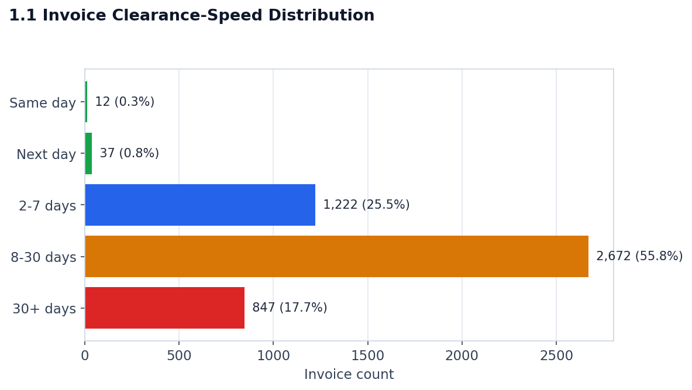
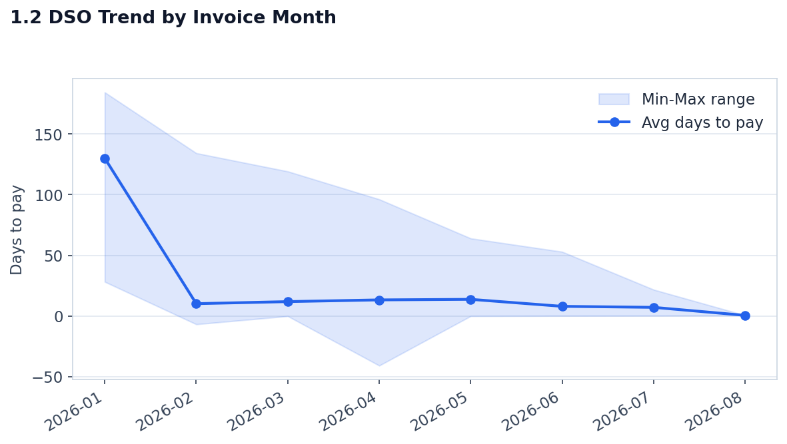
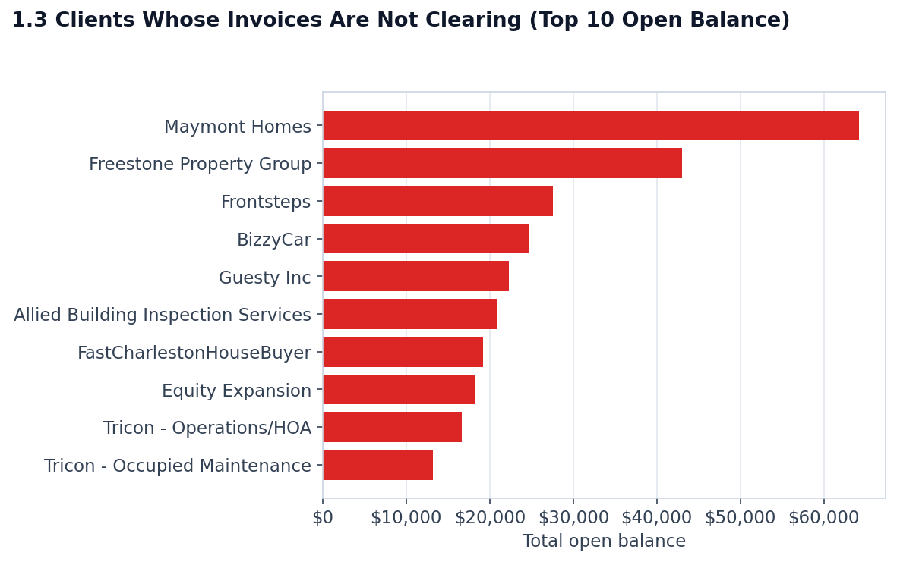
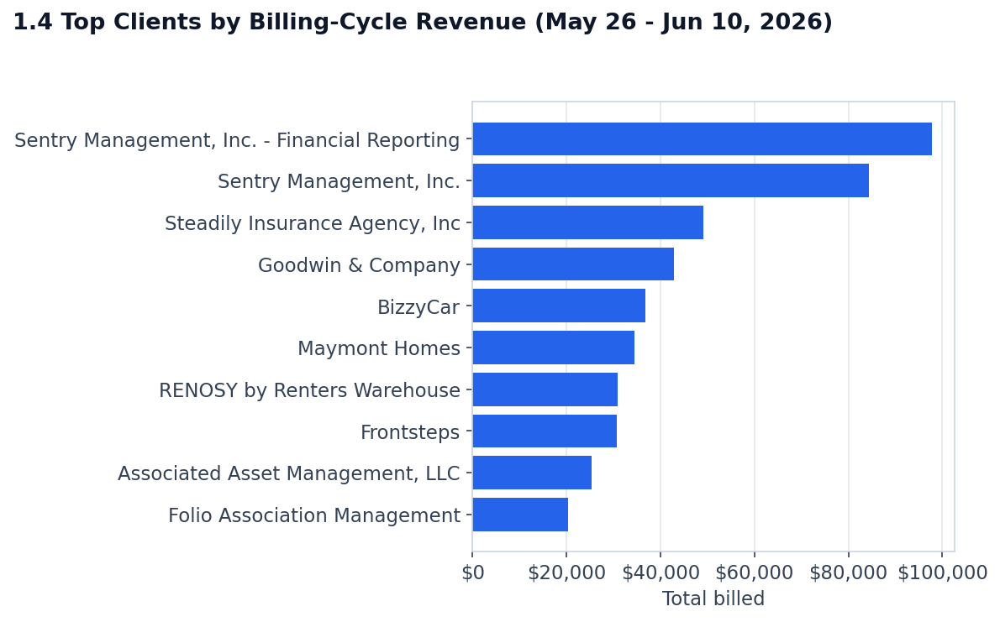

# Financial Health & Revenue Analytics Dashboard

**What this answers:** client billing and revenue health — how much is billed and
collected, how fast invoices clear, which clients are risky on AR, and revenue
concentration by industry/company size. Covers Clients ↔ Invoices.

**Status:** the only dashboard with a built HTML page so far —
[`FinancialHealth&RevenueAnalytics.html`](FinancialHealth&RevenueAnalytics.html)
(open it in a browser to view it; built by a different LLM before this session).
Its 9 original charts now have SQL behind them (they didn't before), and 4 new
reports (1.1-1.4) have been added to the catalog but not yet added to the HTML page
itself — that's a follow-up step once you've reviewed them.

## Folders

- `data/` — the source CSVs this dashboard's queries run against: `active_clients.csv`,
  `Invoices.csv`
- `sqls/` — see the two groups below
- `assets/` — chart images: `1_...` through `9_...` are the original dashboard's
  chart exports; `1.1_...` through `1.4_...` are the new reports

## The two sets of files in `sqls/`

1. **`1_...sql` through `9_...sql`** — pre-existing files that appeared in this
   folder during this session; provenance unclear (see `sqls/NOTES.md` — worth
   asking whoever built the original dashboard where these came from). They're
   good SQL and were the source of a correction described below.
2. **`chart1_...sql` through `chart9_...sql`** — the same 9 charts, independently
   written and validated against the sample database in this session.
3. **`1.1_...sql` through `1.4_...sql`** — the 4 new reports below, not yet in the
   original 9.

Full explanation, including a SQLite bug that was found and worked around, and a
correction to an earlier (wrong) claim that charts 2-3 couldn't be reproduced:
see [`sqls/NOTES.md`](sqls/NOTES.md).

## New Reports (not yet in the HTML dashboard)

### 1.1 — Invoice Clearance-Speed Distribution
*What % of invoices clear same-day / next-day / within a week / are slow?*
SQL: [`sqls/1.1_invoice_clearance_speed.sql`](sqls/1.1_invoice_clearance_speed.sql)
Chart: 

### 1.2 — DSO Trend by Invoice Month
*Is average days-to-pay improving or worsening month over month?*
SQL: [`sqls/1.2_dso_trend_by_month.sql`](sqls/1.2_dso_trend_by_month.sql)
Chart: 

### 1.3 — Clients Whose Invoices Are Not Clearing
*Which clients carry the largest open (unpaid) balance right now?*
SQL: [`sqls/1.3_clients_not_clearing.sql`](sqls/1.3_clients_not_clearing.sql)
Chart: 

### 1.4 — Top Clients by Billing-Cycle Revenue
*Which clients generate the highest invoiced revenue for a given billing cycle?*
SQL: [`sqls/1.4_top_clients_by_billing_cycle.sql`](sqls/1.4_top_clients_by_billing_cycle.sql)
Chart:  (latest full
cycle: May 26 - Jun 10, 2026)

## The original 9 charts

Already live in the HTML page — `assets/1_...png` through `assets/9_...png` are
their original chart exports, and `sqls/chart1_...sql` through `sqls/chart9_...sql`
(or the `sqls/N_...sql` originals) reproduce each one. See the master catalog doc
for a one-line description of each: [Analytics_Requirements_and_Report_Catalog.md, §5](../../docs/Analytics_Requirements_and_Report_Catalog.md#5-financial-analytics-dashboard--update-dont-rebuild).

Full detail on all data-quality findings: see the master
[Analytics_Requirements_and_Report_Catalog.md](../../docs/Analytics_Requirements_and_Report_Catalog.md).
